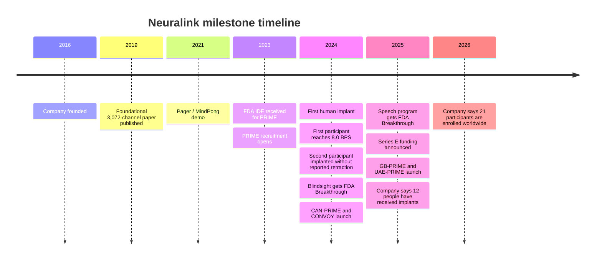

# Neuralink Interview Preparation Report

## Executive Summary

Neuralink is a neurotechnology company founded in 2016 with an official mission to build a “generalized brain interface” that restores autonomy for people with unmet medical needs first and expands human-computer interaction over time. Publicly, the company has moved from preclinical demonstrations to an active international clinical program: the U.S. PRIME study, CAN-PRIME in Canada, GB-PRIME in Great Britain, UAE-PRIME in Abu Dhabi, the CONVOY assistive-device extension, and the VOICE speech-restoration study are all part of its current development story, while Blindsight remains an upcoming visual-prosthesis program with FDA Breakthrough Device designation. In January 2026, the company said 21 participants were enrolled in trials worldwide; earlier, in September 2025, it said 12 people had received implants. citeturn0search2turn13search10turn29search0turn28news30turn13search3turn13search1turn51search1turn32search0turn8search0

For interview preparation, the most important practical point is this: Neuralink is not just “a brain-chip company.” It behaves like a tightly coupled hardware, embedded, silicon, robotics, neuroscience, clinical, and manufacturing organization. Current job postings show teams for implant software, implant embedded systems, SoC design, robotics and surgery engineering, BCI applications, clinical operations, quality, and manufacturing. They also show a culture that prizes exceptional ability, metric-backed accomplishments, direct communication, urgency, cross-functional execution, and shipping reliable systems in safety-critical settings. citeturn43search4turn43search6turn45search2turn44search2turn44search3turn43search3turn44search1

Because you did not specify a target role, this report gives general guidance for engineering and research candidates, with role-specific notes for software, embedded/firmware, ASIC/EE, robotics, neuroengineering/ML, and clinical/research functions.

The short version of what interviewers are likely testing is simple. They will usually care less about whether you can recite brain-computer-interface buzzwords and more about whether you can reason clearly about a real system under hard constraints: signal quality, power, heat, wireless reliability, surgical precision, safety controls, decoder drift, manufacturability, verification, and clinical risk. If you can explain those trade-offs in plain English and connect them to things you have actually built, you will sound much stronger than someone who only talks about sci-fi visions. citeturn15search1turn19view0turn24search0turn47search2turn44search1turn43search6

## Company Overview

Neuralink says its mission is to “restore autonomy to those with unmet medical needs today and unlock human potential tomorrow.” The public company story began in 2016, and by 2019 it had published its foundational high-channel-count BCI paper; by 2023 it had FDA approval to begin the PRIME human study; by 2024 it had implanted its first participant; and by 2025–2026 it had expanded trials internationally and into additional clinical-use cases like assistive-device control and speech restoration. citeturn0search2turn24search0turn13search10turn12search5turn13search3turn13search1turn29search0

Publicly associated leaders include **entity["known_celebrity","Elon Musk","tech entrepreneur"]** as founder and public face; **entity["people","Dongjin Seo","neuralink president"]**, who Reuters and other reporting identified as president and a key technical leader; **entity["people","Matthew MacDougall","neurosurgeon"]**, identified publicly as head of neurosurgery; and **entity["people","Jared Birchall","finance executive"]**, who has been publicly identified in reporting as a finance leader. In late 2025, the company also hired **entity["people","David McMullen","fda device regulator"]** to lead medical affairs, a move that drew attention because he had recently led the FDA office overseeing devices like BCIs. citeturn40search0turn11search1turn40news30

A useful interview-ready way to describe Neuralink’s org structure is: **mission at the top, clinical programs as the product interface, and a layered technical stack underneath**. Public job postings strongly suggest at least these major functional groups:

| Function | What it appears to own | Why this matters in interviews |
|---|---|---|
| Brain Interfaces Hardware | Implant electronics, embedded systems, SoC, power/radio/thermal constraints. citeturn43search6turn45search2 | Expect questions on low-power embedded design, hardware/software boundaries, and verification. |
| Robotics and Surgery Engineering | Surgical robot software, firmware, precision motion, reliability, fail-safe systems, surgical workflow. citeturn42search2turn44search1turn44search2 | Expect controls, precision mechatronics, computer vision, and test infrastructure questions. |
| BCI Applications | Cursor control, user-facing interfaces, interaction design, participant-facing app iteration. citeturn44search3turn63search2 | Expect product/UX questions, latency reasoning, and decoder-to-interface trade-offs. |
| Clinical and Regulatory | Site management, monitoring, GCP, ISO 14155, IDE studies, safety event handling. citeturn43search3turn47search1 | Expect protocol discipline, risk management, documentation, and participant safety questions. |
| Manufacturing and Quality | Acceptance software, verification testing, reliability, calibration, scaling from prototype to production. citeturn43search5turn44search1 | Expect DVT/PVT thinking, fixture design, root-cause analysis, and manufacturability conversations. |

The company’s self-presentation and job postings also imply a very particular style of candidate. Neuralink repeatedly asks applicants to provide several concise examples demonstrating “exceptional ability” with quantitative impact, and multiple roles explicitly emphasize that the candidate should be mission-driven, resourceful, unafraid of hard problems, and focused on delivering reliable solutions rather than polishing perfect research artifacts forever. Many roles also include a clear on-site expectation. That combination is a strong signal that the interview bar is likely “builders with evidence,” not “generalists who talk well.” citeturn44search2turn44search3turn43search4turn43search6

## Technology Stack

At a high level, a brain-computer interface is a system that **records neural activity, converts it into usable digital signals, decodes user intent, and turns that intent into actions like cursor movement, typing, or device control**. Neuralink’s core technical bet is that better outcomes require a whole stack solution rather than a single component: fine flexible threads, implant electronics, wireless power and communications, decoding software, and a robot that can place threads precisely enough to avoid blood vessels and hit the right brain area. citeturn19view0turn24search0turn15search1turn58view0

image_group{"layout":"carousel","aspect_ratio":"16:9","query":["Neuralink N1 implant", "Neuralink R1 robot", "Neuralink thread electrodes"],"num_per_query":1}

One subtle but very important interview detail is that Neuralink’s **current human-trial system is not identical to its 2019 research platform**. The 2019 paper described arrays with up to 3,072 electrodes across 96 flexible threads and a research package streaming full-bandwidth data over USB-C. By contrast, the PRIME study brochure describes the current N1 human-trial implant as a cosmetically invisible, skull-mounted device with 1,024 electrodes across 64 threads, paired with the R1 surgical robot and N1 user software. Candidates who understand that difference will sound more grounded. citeturn24search0turn24search2turn19view0

That architecture is the right mental model for many interviews: sensory input is not the hard part by itself; the hard part is building a **stable, low-latency, safe, recalibratable loop**. The official materials emphasize wireless operation, inductive charging, and full implantability; the jobs emphasize power, radio, thermal, and latency constraints; the clinical updates emphasize calibration, bits-per-second performance, and ongoing participant training. citeturn15search1turn16search0turn43search6turn63search2turn64search0

### Core technical topics in plain English

| Topic | Simple explanation | Main challenges | Typical solutions | Good study resources |
|---|---|---|---|---|
| Intracortical BCI decoding | The implant listens to electrical patterns related to intended movement or communication and uses software to convert them into digital actions. citeturn19view0turn63search2 | Signals drift over time, labels are noisy, latency matters, and patients differ. citeturn64search0turn62search6 | Frequent calibration, adaptive decoders, quality metrics, and user-task design that gives the decoder clearer targets. citeturn64search0turn63search2turn62search0 | Neuralink updates; MNE-Python; SpikeInterface; BrainGate handwriting and speech papers. citeturn56search0turn56search1turn62search0turn62search1 |
| Flexible threads and electrodes | Thin threads can record from many sites while reducing mechanical mismatch compared with rigid arrays. citeturn24search0turn19view0 | They are hard to insert, can move after implantation, and must remain biocompatible. citeturn46search8turn46search4 | Robotic insertion, vessel-avoidance imaging, insertion tooling, and design refinements to thread geometry and surgical procedure. citeturn58view0turn57view0turn11search1 | Neuralink 2019 paper; electrode-design patents; FDA implanted BCI guidance. citeturn24search0turn26view0turn47search2 |
| Implant electronics and chips | Tiny electronics inside the implant amplify, digitize, and manage neural signals under severe energy and space limits. citeturn24search2turn15search1 | Noise, power draw, heat, radio bandwidth, packaging density, and reliability. citeturn43search6turn45search2turn57view0 | Low-power DSP/accelerators, multiplexing, compression, dense packaging, and hardware/software co-design. citeturn58view0turn57view0turn45search2 | Neuralink SoC job descriptions; ARM docs; UVM guide; digital design practice. citeturn45search2turn61search5turn61search2 |
| Wireless power and telemetry | The implant has to recharge and communicate without a wire crossing the skin. citeturn15search1turn16search0 | Charger artifacts, tissue heating, pairing security, dropouts, and EMI. citeturn58view0turn57view0 | Shielded coils, self-resonant coils, robust link protocols, secure pairing, and artifact-aware sensing. citeturn58view0turn57view0 | Neuralink technology materials; power-coil and pairing patents; embedded RF/security practice. citeturn15search3turn57view0 |
| Surgical robot | The robot inserts extremely fine threads with high precision and must avoid visible vasculature. citeturn19view0turn24search0 | Micron-scale targeting, tool reliability, vision-guided motion, fail-safe behavior, and throughput. citeturn24search0turn44search1 | Imaging-based vessel avoidance, hardware-in-the-loop test rigs, maintenance/calibration schedules, and rigorous design controls. citeturn58view0turn44search1 | Neuralink robot posts/jobs; ROS docs for robotics fundamentals; mechatronics/test work. citeturn42search2turn44search1turn61search8 |

### Official products and programs

| Product or program | What it is | Development status that matters for interviews |
|---|---|---|
| **Telepathy** | Neuralink’s first product layer for direct control of computers, phones, and robotic limbs using thought. citeturn31search0 | Active human-use program; in Jan. 2026 the company said 21 participants were enrolled in trials worldwide, and in Sept. 2025 it said 12 people had received implants. citeturn29search0turn28news30 |
| **N1 Implant** | The current investigational, fully implantable BCI used in human studies; the PRIME brochure describes 1,024 electrodes across 64 threads, wireless operation, and cosmetic invisibility. citeturn19view0turn16search0 | In ongoing early-feasibility trials; this is the device you should assume interviewers mean unless they explicitly ask about the 2019 research platform. citeturn13search10turn36search5 |
| **R1 Robot** | The surgical robot that places the N1 threads into the brain. citeturn19view0 | Used in PRIME-family studies and central to Neuralink’s automation, reliability, and scale-up story. citeturn13search10turn44search1turn53search1 |
| **CONVOY** | A follow-on study that lets PRIME participants use the N1 Implant to control an assistive robotic arm and related devices. citeturn7search1turn35search0 | Launched in late 2024 and designed as a cross-enrollment extension from PRIME. citeturn13search8turn35search8 |
| **VOICE** | An early-feasibility speech-restoration study using the N1/R1 systems for communication restoration; the public trial materials describe output of text or synthesized voice for people with severe speech impairment. citeturn14search1turn32search0 | Active/recruiting as of late 2025; in Jan. 2026 Neuralink said it was targeting conversational speeds of 140 words per minute. citeturn32search0turn14search0 |
| **Blindsight / Visual Prosthesis** | An upcoming visual-cortex prosthesis program intended to restore visual perception for people with severe vision impairment. citeturn8search0turn8search1 | Not yet a public human trial program on the site; it has FDA Breakthrough Device designation. citeturn1search1turn47news30 |
| **Reported future “Deep”** | Reuters, citing investor documents reported by Bloomberg, said Neuralink planned a future version aimed at tremors and Parkinson’s disease. citeturn11news22 | Treat this as a **reported roadmap item**, not an officially detailed public product page. citeturn11news22 |

## Products, Milestones, and Regulation

The quickest way to understand Neuralink’s maturity is to follow the regulatory and clinical timeline rather than the marketing language. The PRIME Study opened for recruitment in 2023 under an FDA investigational device exemption. That is important because an IDE is the FDA pathway that allows significant-risk investigational devices to be used in clinical studies to collect safety and effectiveness data. In other words, PRIME is not commercial deployment; it is structured evidence generation. citeturn13search10turn47search1turn47search13

That milestone sequence comes from a mix of official company updates, official trial pages, and Reuters reporting. The single most important clinical fact for an interview is that Neuralink is still in **early feasibility** mode. That means interviewers will often reward answers that emphasize safety, learning, monitoring, and iteration over answers that jump straight to scale or flashy features. citeturn13search10turn35search0turn32search0turn47search1

A second important interview fact is the company’s early human performance story. In May 2024, Neuralink said its first public participant, **entity["people","Noland Arbaugh","first neuralink recipient"]**, set a human BCI cursor-control record of 4.6 BPS in his first research session and later reached 8.0 BPS. Neuralink also says able-bodied mouse users average around 8–10 BPS on the same Webgrid task, which is why the company uses bits per second so heavily in public updates. For interview purposes, you should know what BPS means, why it matters, and how calibration, UI design, and model adaptation affect it. citeturn64search0turn63search0turn63search1

The first human implant also produced one of Neuralink’s most important engineering lessons. Reuters reported that the first participant experienced post-surgical thread retraction that reduced the amount of usable neural signal, and the company later described mitigation steps such as skull-surface shaping and other surgical/process changes. Conversely, the company’s August 2024 update on the second participant said it had observed no thread retraction in that case, and on day two the participant was already using CAD software. In interviews, this is a perfect example of the broader principle that **biomechanics, not just software, can dominate system performance**. citeturn46search8turn11search1turn46search4turn65search0

International expansion also matters. Neuralink launched CAN-PRIME after approval from **entity["organization","Health Canada","canadian regulator"]** and selected **entity["organization","University Health Network","Toronto, ON, CA"]** as the Canadian site. It later launched GB-PRIME with **entity["organization","University College London Hospitals NHS Foundation Trust","London, England, UK"]** and **entity["organization","The Newcastle upon Tyne Hospitals NHS Foundation Trust","Newcastle upon Tyne, England, UK"]**, and UAE-PRIME in collaboration with **entity["organization","Cleveland Clinic Abu Dhabi","Abu Dhabi, Abu Dhabi, AE"]** and the Abu Dhabi health ecosystem. The U.S. first-in-human surgery was performed at **entity["organization","Barrow Neurological Institute","Phoenix, AZ, US"]**. That tells you the company is dealing with the harder real-world problems of multi-site operations, varying regulators, and clinical partner execution. citeturn50news21turn50search1turn50search2turn48search0turn51search0turn51search1turn51search12turn1search3turn4search1

The FDA milestones are also interview gold. Neuralink’s speech-restoration device received Breakthrough Device designation in 2025, and Blindsight received the same designation in 2024. The official FDA description of the Breakthrough Devices Program is that it is meant to speed development, assessment, and review for qualifying devices while preserving the standard safety and effectiveness bar. A strong candidate answer will recognize that “breakthrough” means **faster collaboration and review**, not “approved for sale.” citeturn12search1turn1search1turn47search0turn47search12

## Research Papers and Patents

### Key papers worth knowing

Neuralink itself has not built its public interview narrative around a long list of peer-reviewed human-trial papers yet. So the best interview prep is to combine the company’s 2019 foundation paper with the external papers that define the broader state of the art in handwriting, speech, and communication neuroprostheses.

| Paper | Plain-English summary | Why it matters for a Neuralink interview |
|---|---|---|
| **An Integrated Brain-Machine Interface Platform With Thousands of Channels** | Neuralink’s 2019 foundation paper introduced the company’s basic thesis: flexible threaded electrodes, a robot for precise insertion, and custom electronics for high-channel-count recording. It described up to 3,072 electrodes across 96 threads, thread insertion at six threads per minute, and a compact implant package. citeturn24search0turn24search2 | This is the origin story for the entire stack. You should know the paper’s big idea and also know that the current human device is a narrower, more clinical version. |
| **High-performance brain-to-text communication via handwriting** | This Nature paper showed that an intracortical BCI could decode attempted handwriting into text in real time, reaching 90 characters per minute with strong accuracy. citeturn62search0 | It is one of the clearest demonstrations that rich motor-intent representations can actually outperform simpler cursor-by-cursor spelling schemes. It is highly relevant to how Neuralink frames text entry and communication. |
| **A high-performance speech neuroprosthesis** | This Nature paper showed attempted-speech decoding at 62 words per minute, moving speech BCIs much closer to natural communication speed. citeturn62search1turn62search12 | This is directly relevant to VOICE. If you want to sound prepared for Neuralink’s speech work, you should understand why speech decoding is harder and more promising than cursor typing. |
| **A high-performance neuroprosthesis for speech decoding and avatar control** | This Nature paper combined surface cortical recording with text, speech-audio, and avatar animation output. citeturn62search4turn62search19 | It matters because communication is not just text throughput. It is also expressivity, embodiment, and user experience. That is very consistent with how Neuralink’s BCI applications and speech work are evolving. |
| **An Accurate and Rapidly Calibrating Speech Neuroprosthesis** | This 2024 NEJM paper focused on fast calibration and practical communication use. citeturn62search24 | Neuralink interviews often reward candidates who think about calibration burden and day-to-day usability, not just peak benchmark numbers. |

A strong, plain-English answer if asked about the literature is: “The field has shown that meaningful communication can be restored through handwriting decoding, speech decoding, and avatar/speech systems. Neuralink’s public work fits that trajectory, but its differentiator is trying to integrate electrodes, implant electronics, robot insertion, wireless operation, and clinical scaling into one product stack.” That answer is accurate, simple, and interview-appropriate. citeturn24search0turn62search0turn62search1turn62search4

### Key patent themes in plain language

You do not need to memorize patent numbers, but you should understand what the patents reveal about the company’s engineering priorities.

| Patent theme | Plain-language summary | What it signals |
|---|---|---|
| Electrode fabrication and design | Neuralink patented biocompatible multi-electrode devices and multi-thread arrays that can be implanted with a single needle insertion. citeturn26view0 | Threads are not just “wires”; they are a precision-manufactured product problem. |
| Vascular segmentation and avoidance using imaging | A patent application describes image processing that finds blood vessels so the robotic insertion system can halt or redirect away from them. citeturn58view0 | Neuralink treats surgery as a computer vision and robotics problem, not merely a neurosurgical manual skill. |
| Neural signal compression | Patents describe lossless, lossy, binned spike, and spike-band-power compression methods for neural data. citeturn58view0 | Bandwidth and energy are first-class constraints; decoding starts with information management, not just AI. |
| Static and dynamic multiplexing | Patents describe selecting the most informative subset of inputs and routing them to amplifier channels dynamically. citeturn58view0 | Again: channels are expensive. Good system design means being smart about which signals matter in real time. |
| Wireless power and charger shielding | Patents describe self-resonant coils and shielding methods that reduce charging artifacts and electric-field exposure while preserving inductive power transfer. citeturn57view0turn58view0 | Power delivery is a safety and signal-integrity problem, not just a convenience feature. |
| Secure pairing for a wireless neural implant | A recent patent covers out-of-band pairing and defenses against man-in-the-middle attacks. citeturn57view0 | Neuralink is already thinking about neural-device cybersecurity. Interviewers may expect you to do the same. |
| In-vitro implant tester with hardware-in-the-loop simulation | A patent describes accelerated implant testing with submerged devices, RF communication, and server control. citeturn58view0 | This is a clue that verification, reliability, and accelerated life testing matter as much as novel features. |
| High-density packaging and chip interconnects | Patents describe cylindrical packaging and embedded-chip interconnects for dense electronics in a tiny implant. citeturn57view0 | Packaging is core product engineering, not a minor detail. |

The main lesson from the patent portfolio is that Neuralink is solving a **systems integration problem**. The patents are not narrowly about “reading thoughts.” They are about manufacturable electrodes, insertion tooling, packaging, power, telemetry, validation, and security. That is exactly how you should frame your interview answers. citeturn26view0turn57view0turn58view0

## Landscape, Collaborators, and Controversies

### Competitors and adjacent players

Interviewers may ask whether you understand the competitive landscape. The best way to answer is not with hype, but by explaining the major design trade-offs.

| Company | Core approach | Main trade-off versus Neuralink | Current status |
|---|---|---|---|
| **entity["company","Synchron","bci company"]** | Endovascular “Stentrode” approach inserted through blood vessels rather than open-brain thread insertion. citeturn52search0turn52search4 | Potentially less invasive surgery, but less direct access than penetrating intracortical threads. | Official materials say six people completed the U.S. COMMAND trial with 12 months of safety follow-up, and Reuters reported the company was preparing for a larger trial to pursue commercial approval. citeturn54search7turn55search0 |
| **entity["company","Blackrock Neurotech","bci company"]** | Longstanding microelectrode-array platform used in research and human BCI studies. citeturn52search1turn52search5 | More established research footprint and strong signal quality, but historically less integrated as a consumer-style fully implanted product story. | Blackrock says patients have achieved high-rate typing and device control, and the company notes dozens of human implants through research collaborations. citeturn52search1turn52search11 |
| **entity["company","Precision Neuroscience","bci company"]** | Thin cortical-surface film rather than penetrating threads. FDA-cleared Layer 7 platform for temporary implantation up to 30 days. citeturn52search2turn52search15turn52search6 | Less invasive surface contact may help safety and placement, but usually trades off neuronal specificity compared with penetrating arrays. | FDA 510(k) clearance in 2025 for temporary cortical use; fully implantable wireless system still in development. citeturn52search6turn54search17 |
| **entity["company","Paradromics","bci company"]** | High-data-rate penetrating Connexus platform aimed heavily at speech and communication restoration. citeturn52search3turn52search7 | Similar “high-bandwidth invasive” ambition, but currently more explicitly speech-focused and less far along in chronic human implantation. | First-in-human recording completed in 2025; FDA IDE for Connect-One early-feasibility study granted in late 2025. citeturn52search3turn52search7 |

The useful interview takeaway is that Neuralink’s differentiation is **product-stack integration** and robotic implantation, not simply “having a chip.” Competitors each pick different points on the invasiveness-versus-bandwidth curve, and a mature answer should acknowledge that there is no free lunch here. Less invasive systems may simplify surgery; more invasive systems often promise richer signals; surface systems may have different regulatory and safety profiles; and clinical success depends on usability, not just neuroscience elegance. citeturn52search0turn52search1turn52search6turn52search7

### Collaborators and clinical partners

Neuralink’s most visible collaborators are clinical and hospital partners rather than major academic co-development partners. Those include **entity["organization","University Health Network","Toronto, ON, CA"]** in Canada, **entity["organization","University College London Hospitals NHS Foundation Trust","London, England, UK"]** and **entity["organization","The Newcastle upon Tyne Hospitals NHS Foundation Trust","Newcastle upon Tyne, England, UK"]** in Great Britain, **entity["organization","Cleveland Clinic Abu Dhabi","Abu Dhabi, Abu Dhabi, AE"]** in the UAE, and **entity["organization","Barrow Neurological Institute","Phoenix, AZ, US"]** for early U.S. implantation. For interview prep, that means the company is already operating as a multi-site, multinational medical-device program, which raises the importance of quality systems, regulatory discipline, and reproducible training and data workflows. citeturn50search1turn48search0turn51search0turn51search1turn1search3turn4search1

### Recent controversies and why they matter in interviews

Neuralink has faced sustained scrutiny over animal research practices. Reuters reported internal complaints in 2022 that the company’s animal testing was rushed and under federal scrutiny, and later reported FDA inspection findings around record-keeping and quality controls for animal experiments. Neuralink has responded with public posts on preclinical research and animal welfare, saying its animal work is confirmatory rather than exploratory and describing husbandry and refinement practices. A balanced interview answer should acknowledge both the ethical weight of the criticism and the reality that invasive implantable devices require substantial preclinical evidence before human trials. citeturn46search6turn46search3turn69search0turn69search1turn70search0

The other major controversy is trial transparency. Reuters noted in early 2024 that members of the public had little technical information about the first implant beyond what **entity["known_celebrity","Elon Musk","tech entrepreneur"]** and the company chose to disclose, because early-feasibility device studies do not require the same public reporting cadence as a marketed product. This matters because interviewers may want to know whether you understand the difference between public demo narratives and formal evidence packages. citeturn53search16turn47search1

Thread retraction in the first participant is a third important controversy because it is not merely reputational; it is deeply technical. Reuters reported that the issue had been seen before in animal work and that Neuralink took risk-mitigation steps in subsequent implants. This is a reminder that difficult biological interfaces often fail at the boundary between excellent bench engineering and messy living tissue. If asked about the setback, sound calm: describe it as an early-feasibility learning event that highlights the importance of biomechanics, placement, retention, monitoring, and software adaptation. citeturn46search1turn46search8turn46search4

A newer concern is governance and regulatory optics. Reuters reported that Neuralink hired **entity["people","David McMullen","fda device regulator"]**, a recent senior FDA device regulator, to lead medical affairs, raising “revolving door” questions. Whether or not one sees that as concerning, it is another example of how a company like Neuralink lives at the intersection of engineering, medicine, policy, and public trust. citeturn40news30

## Interview Map

### What the company appears to want by role

Because your target role is unspecified, the safest interview strategy is to prepare one layer deep in your specialty and one layer broad across the system.

| Role family | What the work looks like | Likely interview themes | Likely practical tasks |
|---|---|---|---|
| Software / BCI applications | SDKs, build tooling, implant monitoring, recorder systems, manufacturing acceptance software, user-facing interaction design. citeturn43search4turn43search5turn44search3 | Systems design, Linux, production reliability, APIs, latency, UX under unusual input conditions. | Write a robust service, packet parser, logging/monitoring flow, or interface prototype. |
| Embedded / firmware | Bare-metal C or Rust, ARM-class embedded work, power/radio/thermal constraints, safety-critical systems, HW/SW debugging. citeturn43search6turn45search1 | Concurrency, interrupts, state machines, scheduling, RF/BLE/TCP-IP basics, fault handling, instrumentation. | Implement a ring buffer, telemetry pipeline, power-aware scheduler, or boot/update design. |
| ASIC / digital IC / EE | Low-power DSP, accelerators, radio MAC/PHY, serial links, architecture-to-RTL work, silicon bring-up. citeturn45search2turn45search4 | Energy/performance trade-offs, hardware/software interface, DSP pipelines, verification, DFT/UVM concepts. | Design an RTL block, estimate throughput/power, or explain a verification plan. |
| Robotics / controls / test | Surgical robot software, precision motion, hardware-in-the-loop tests, calibration, reliability, maintenance schedules. citeturn42search2turn44search1turn44search2 | Kinematics, controls, failure modes, test strategy, CV-guided targeting, mechatronic debugging. | Tune/control a mechanism, design a test fixture, or walk through safety interlocks. |
| Neuroengineering / ML | Neural recording/stimulation experiments, computational models, stimulation encoding, machine vision for prosthetic vision, analysis in Python. citeturn43search2 | Signal processing, statistical inference, closed-loop BCI, model evaluation, experiment design. | Decode a dataset, analyze drift, compare models, or design a calibration protocol. |
| Clinical / research operations | Site monitoring, regulatory compliance, source-data review, adverse-event tracking, IDE/PMA study support. citeturn43search3 | GCP, ISO 14155, 21 CFR Part 812, risk mitigation, inspection readiness, participant safety. | Review a protocol deviation, propose CAPA, or explain monitoring priorities. |

### Culture fit questions you should expect

Public job postings strongly imply that Neuralink wants people who are unusually high-agency and unusually evidence-oriented. These are the behavioral questions I would expect, and they are more important than many candidates realize. citeturn44search2turn43search4turn43search6

**Tell me about your three strongest examples of exceptional ability.**  
Model answer pattern: pick **three stories with numbers**. Each should say: what the constraint was, what you personally built or changed, and what measurable outcome improved. Neuralink’s own applications explicitly ask for concise examples with quantitative metrics, so “I helped with” is weaker than “I reduced packet loss by 43%, cut calibration time from 20 minutes to 4 minutes, or shipped a test fixture that doubled throughput.” citeturn44search2turn44search3turn45search4

**Describe a time you shipped something in a messy environment.**  
Model answer: explain how you defined a minimum safe/reliable solution, created observability, iterated quickly, and avoided over-design. Neuralink repeatedly emphasizes delivering reliable manufacturable solutions rather than lingering in research-grade perfection. citeturn43search4turn43search6

**Have you worked across disciplines where you were not the domain expert in every layer?**  
Model answer: show that you can work with electrical, firmware, software, robotics, neuroscience, and clinical stakeholders without pretending you are the expert in all of them. Strong candidates translate constraints across boundaries. That is exactly how the job postings read. citeturn42search2turn43search6turn44search3

**Why Neuralink rather than another neurotech company?**  
Model answer: “Because the company is attempting end-to-end productization of an implanted BCI stack: electrodes, implant electronics, robot insertion, software, clinical evidence, and manufacturing. I want to work at the layer where hard engineering constraints meet real patient outcomes.” That answer is much better than “I want to work on sci-fi.” citeturn24search0turn19view0turn44search1

## Likely Technical Questions and Concise Model Answers

### Software and systems

**How would you design the software architecture for a thought-controlled cursor system?**  
A good answer starts with the pipeline: device telemetry ingestion, timestamping, buffering, filtering/features, decoder inference, UI/action layer, calibration loop, observability, and fail-safe handling. Then mention the key constraints: low latency, packet loss tolerance, versioned models, replayable logs, and online calibration without breaking user trust. Neuralink’s public system materials and software jobs line up well with exactly this kind of answer. citeturn19view0turn43search4turn43search5

**Why is “research-grade” software not enough here?**  
Model answer: “Because the user is depending on the system every day. In this setting, correctness, version control, monitoring, reproducibility, and rollback matter as much as model performance. A slightly weaker decoder with excellent reliability can be better than a better benchmark model that is hard to operate safely.” That framing matches the software roles almost word for word. citeturn43search4turn43search5

### Embedded and firmware

**What are the key constraints for firmware inside an implantable BCI?**  
Model answer: “Power, heat, radio reliability, timing determinism, memory limits, safety, and secure communications. You cannot optimize only for throughput, because a great signal path that overheats tissue or drops packets under edge cases is not a viable medical product.” That combines the implant and embedded role descriptions with the wireless/power patent clues. citeturn43search6turn57view0turn58view0

**How would you handle packet loss in neural telemetry?**  
A good concise answer: sequence numbers, CRCs, bounded retransmission only where latency allows, loss-aware decoder behavior, and good timestamp handling so downstream systems can gracefully degrade rather than fail abruptly. Mention that in some BCI paths, a little controlled loss can be better than aggressive retransmission if it harms latency. That is the kind of trade-off reasoning interviewers usually like. citeturn43search6turn45search2

### ASIC and electrical engineering

**Why would Neuralink care about signal compression and multiplexing so much?**  
Model answer: “Because raw neural data is expensive in bandwidth and power. Compression and dynamic channel selection let you preserve useful information while meeting implant power, thermal, packaging, and telemetry limits.” That is directly supported by the compression and multiplexing patents. citeturn58view0

**Suppose you can add more channels. Why might that still not improve user performance?**  
Model answer: “Extra channels can help, but only if they add stable signal quality without overwhelming power, bandwidth, decoder complexity, packaging, and surgical risk. More channels are only good if the whole system can exploit them.” This is a very strong Neuralink-style systems answer. citeturn24search0turn45search2turn57view0

### Robotics and controls

**Why use a robot to insert threads instead of manual surgery?**  
Model answer: “Because the threads are extremely fine, and the robot can place them with precision, speed, and consistency while using imaging to avoid visible surface vasculature. The point is not replacing surgeons with a gimmick; it is making a delicate insertion task repeatable and scalable.” citeturn24search0turn19view0turn58view0

**How would you validate a surgical robot for expanding trial volume?**  
A good answer: define critical failure modes, build hardware-in-the-loop and accelerated tests, trend calibration drift, enforce maintenance schedules, collect structured field logs, and tie everything back to design controls and CAPA. That is almost exactly how the reliability/test role is written. citeturn44search1

### Neuroengineering and machine learning

**How do you explain decoder drift to a non-expert?**  
Model answer: “The brain signal you measure today is not exactly the same signal you measure next week, even if the person intends the same movement. Biology changes, the interface changes, and the model must adapt.” If you then mention recalibration, domain alignment, and user-task design, you will sound strong. citeturn64search0turn62search6

**What is the difference between decoding attempted movement and attempted speech?**  
Model answer: “Movement decoding usually maps to lower-dimensional continuous control like cursor kinematics. Speech decoding often has richer, faster, and more linguistically structured targets, but also higher ambiguity, larger vocabulary problems, and stronger privacy concerns.” That answer is simple and sophisticated without drowning in jargon. citeturn62search1turn62search4turn32search0

### Ethics, privacy, and security

**What is the hardest ethical issue in implantable BCIs?**  
A strong answer is not “AI taking over the mind.” A stronger answer is: “In the near term, the hard issues are informed consent, safety, mental privacy, post-trial support, equitable access, and keeping users in control when the decoder inevitably makes mistakes.” If you also mention cybersecurity and the company’s secure-pairing patent, that is even better. citeturn47search2turn57view0turn53search16

**How would you discuss privacy without sounding alarmist?**  
Model answer: “Today’s implanted BCIs infer limited task-related intent, not broad mind reading. But they still produce sensitive neural data, so you should build least-privilege access, secure pairing, encryption, clear consent boundaries, and transparent model behavior from the start.” That is realistic, measured, and engineer-like. citeturn57view0

## Study Plan

### What to learn first

If your interview is soon, prioritize in this order:

| Priority | Focus | What “good enough” looks like |
|---|---|---|
| Highest | Understand the current product stack | You can clearly explain N1, R1, Telepathy, CONVOY, VOICE, and Blindsight in plain English, and you know which are active trials versus future programs. citeturn19view0turn31search0turn7search1turn32search0turn8search0 |
| Highest | Know the clinical/regulatory timeline | You know what an IDE is, what Breakthrough designation means, when PRIME opened, when the first implant happened, and what the thread-retraction lesson was. citeturn13search10turn47search1turn47search0turn46search8 |
| High | Build one role-relevant technical depth area | Embedded candidates: power/radio/latency. Software candidates: pipeline reliability and observability. Robotics candidates: precision motion and HIL testing. Neuro/ML candidates: decoding, calibration, and signal stability. citeturn43search6turn43search4turn44search1turn43search2 |
| High | Prepare three quantified stories | Each story should have hard numbers, your personal ownership, and what changed because of you. citeturn44search2turn44search3 |
| Medium | Understand the competitor map | You can explain why Synchron, Blackrock, Precision, and Paradromics are different choices, not just “other brain-chip companies.” citeturn52search0turn52search1turn52search6turn52search7 |
| Medium | Be ready for ethics/security discussion | You can discuss mental privacy, decoder mistakes, informed consent, and secure pairing calmly and concretely. citeturn57view0turn47search2 |

### Best resources by topic

For interview prep, I would not try to read everything. I would read a **small set extremely well**.

| Topic | Best starting resources |
|---|---|
| Neuralink foundation | Neuralink 2019 paper; PRIME study brochure; PRIME progress updates; A Year of Telepathy; Two Years of Telepathy. citeturn24search0turn19view0turn12search5turn12search2turn29search0 |
| BCI decoding and communication | Handwriting BCI paper; speech neuroprosthesis papers; rapid-calibration speech paper. citeturn62search0turn62search1turn62search4turn62search24 |
| Neural-data tooling | MNE-Python; SpikeInterface; Open Ephys GUI/docs. citeturn56search0turn56search1turn56search6turn56search10 |
| Modeling and stimulation | NEURON simulator docs and tutorials. citeturn56search3turn56search19 |
| Robotics | ROS 2 docs for systems patterns and interfaces. citeturn61search8turn61search12 |
| ML implementation | PyTorch tutorials and reference docs. citeturn61search3turn61search11 |
| Embedded and silicon verification | ARM documentation; UVM guide/cookbook. citeturn61search5turn61search2turn61search10 |
| Regulatory | FDA IDE overview; implanted BCI guidance; Breakthrough Devices Program. citeturn47search1turn47search2turn47search0 |

### Portfolio projects that would impress

If you have time to build or polish a project before the interview, I would prioritize one of these:

**A neural-decoder mini-pipeline.**  
Use a public electrophysiology dataset and build a simple filter → feature extraction → decoder → online recalibration loop. Show latency, accuracy, and robustness trade-offs. If you can talk about drift and calibration rather than just a leaderboard metric, that is a big plus. Use tools like MNE-Python or SpikeInterface where appropriate. citeturn56search0turn56search1turn62search0turn62search1

**A robust implant-telemetry simulator.**  
In C, Rust, or Python, simulate timestamped packets, packet loss, compression, and decoder-side reconstruction. Show how you would test failure modes and monitor quality in production. This maps extremely well to both software and embedded roles. citeturn43search4turn43search6turn58view0

**A robot-test or HIL fixture demo.**  
If you are more robotics/mechatronics oriented, build a small precision-motion system with calibration, fault injection, and logging. Strong candidates in this track should talk fluently about repeatability, fixture design, and design controls. citeturn44search1turn44search2

**A low-power signal-processing or RTL block.**  
ASIC candidates should demonstrate a small but clean RTL/DSP block with a verification strategy, not just a homework algorithm. A spike-band-power feature extractor, mux/packetizer, or compression block tied to realistic throughput and energy assumptions would be very on-theme. citeturn45search2turn58view0

**A BCI interaction prototype.**  
For software or design roles, prototype an interface that works under low-bandwidth, imperfect cursor control: dwell selection, snap targets, adaptive target sizes, confidence-aware UI, and recovery from decoder uncertainty. That maps directly to the BCI applications team’s constraints. citeturn44search3turn63search2

### Final prioritized checklist

Before the interview, I would make sure you can do these ten things without notes:

- Explain Neuralink’s current product stack in under two minutes. citeturn31search0turn19view0turn7search1turn32search0turn8search0
- Distinguish the 2019 3,072-channel research platform from the current 1,024-electrode N1 clinical system. citeturn24search0turn19view0
- Explain what an IDE is and what Breakthrough Device designation is not. citeturn47search1turn47search0
- Describe the first-patient thread-retraction issue and the lesson it teaches about biology/system design. citeturn46search8turn46search4
- Define BPS and why Neuralink uses it. citeturn63search0turn64search0
- Compare Neuralink with Synchron, Precision, Blackrock, and Paradromics without sounding tribal. citeturn52search0turn52search1turn52search6turn52search7
- Tell three metric-backed accomplishment stories. citeturn44search2turn44search3
- Walk through one end-to-end system you built, including failure modes and monitoring. citeturn43search4turn43search6turn44search1
- Speak calmly about ethics, security, and mental privacy. citeturn57view0turn47search2
- Ask smart questions of your interviewer: what failure mode currently dominates performance, where the biggest bottleneck sits today, how teams hand off between hardware/robotics/software/clinical, and what “great first six months” looks like for the role. The public job structure strongly suggests those are exactly the seams where work happens. citeturn43search4turn43search6turn44search1turn43search3

navlistRecent Neuralink developmentsturn40news30,turn11news23,turn40news31,turn47news30,turn50news21,turn51news32